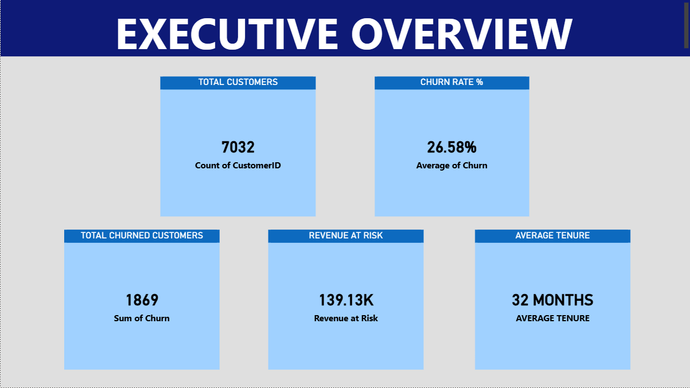
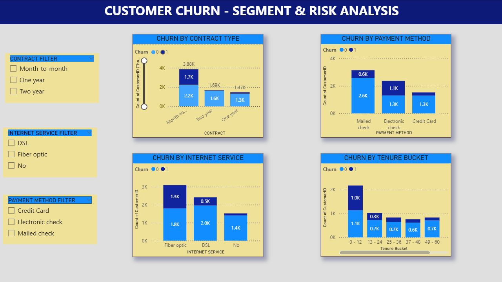
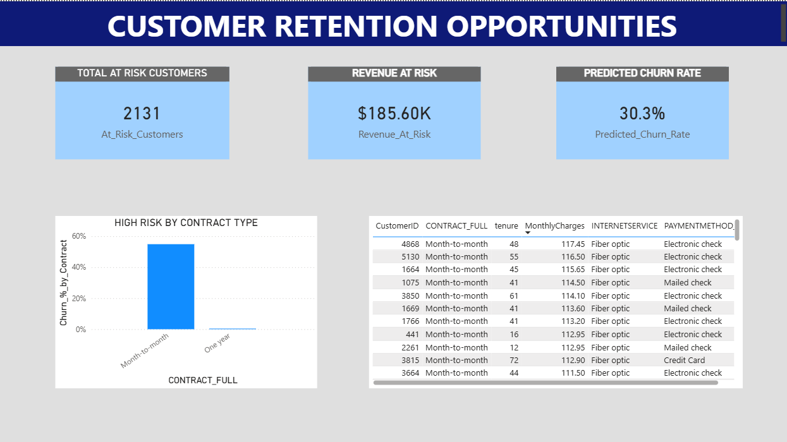

# Customer Churn & Retention Analysis

## 📌 Project Overview
This project analyzes customer churn for a telecom/subscription company. The goal is to identify churn drivers, estimate revenue at risk, predict churn using machine learning, and recommend actionable retention strategies.

## 🎯 Business Problem
Customer churn directly impacts recurring revenue. The objectives are:
- Calculate churn KPIs using SQL
- Segment customers by risk & value
- Predict churn using Logistic Regression
- Create executive dashboards
- Recommend retention strategies to reduce churn

## 📂 Dataset
This project uses the **Telco Customer Churn Dataset** available on Kaggle:
🔗 https://www.kaggle.com/datasets/blastchar/telco-customer-churn
The dataset contains customer demographics, account information, services subscribed, and churn status.

## 📁 Repository Structure
- churn_analysis.ipynb — Data cleaning, EDA & modeling
- sql_queries.sql — KPI extraction queries
- sql_insights.md — SQL findings & explanations
- Retention_Strategy.md — Business recommendations
- churn_overview.png — Executive dashboard
- segment_risk.png — Risk segmentation dashboard
- retention_opportunities.png — Retention insights dashboard

## 🛠 Tools Used
- **SQL (MySQL)** — KPI extraction and segmentation
- **Python** — pandas, scikit-learn, matplotlib/seaborn for cleaning, EDA, and modeling
- **Power BI** — dashboards and visual insights
- **Jupyter Notebook** — workflow documentation

## 🗄 SQL Analysis
- Total customers
- Total churned customers
- Churn rate %
- Revenue at risk
- Churn by contract type, payment method, internet service

**Key Insight:** Month-to-month customers and electronic check users have the highest churn rates.

## 🐍 Python Analysis & Modeling
**Data Preparation:**
- Handled missing values
- Converted Yes/No → 1/0
- Feature engineering: tenure groups, charge buckets
- One-hot encoding for categorical variables

**Models Built:**
- Logistic Regression (class_weight = balanced)
- Random Forest Classifier (optional for comparison)

**Model Performance:**
- ROC-AUC: 0.83
- Recall (Churn class): 0.79
- Accuracy: 0.73

**Business Insight:** Customers with month-to-month contracts and high monthly charges are significantly more likely to churn.

## 📊 Dashboard Overview
**Power BI Dashboard Screenshots:**

**1️⃣ Executive Overview**  

**2️⃣ Segment Risk Analysis**  

**3️⃣ Retention Opportunities**  

## 🧠 Retention Strategy
See [Retention Strategy](Retention_Strategy.md) for actionable recommendations:
- Convert month-to-month customers to yearly plans with incentives
- Target high-value, high-risk customers with discounts & loyalty rewards
- Proactively engage new customers to improve onboarding
- Encourage stable payment methods to reduce churn risk

## 🚀 Project Impact
This project demonstrates:
- End-to-end data analysis workflow (SQL → Python → Dashboard)  
- Predictive modeling with business interpretation  
- Visual storytelling for executives  
- Actionable recommendations to reduce churn and protect revenue  

## 💼 Professional Value
This project demonstrates practical business-focused analytics, predictive modeling, and executive communication skills aligned with Data Analyst and Business Analyst roles.

